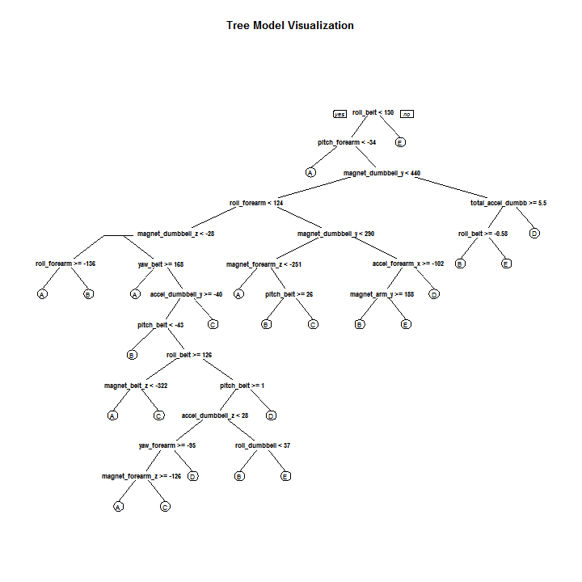

Predict Human Activity Using Activity Monitors
========================================================
### 0 Load Libraries

```r
library(caret)
library(rpart)
library(rpart.plot)
library(ROCR)
```

### 1 Load Data

```r
training <- read.csv("pml-training.csv", stringsAsFactors = F)
testing <- read.csv("pml-testing.csv", stringsAsFactors = F)
```

### 2 Data Preprocessing
Convert class feature to factor

```r
training$classe <- as.factor(training$classe)
```

Many features are not generated form the sensors, they should be excluded, so is the same to the features containing NAs.

```r
# remove features containing NA.
training <- training[, colSums(is.na(training)) == 0]
testing <- testing[, colSums(is.na(testing)) == 0]
# remove features not from the sensors
training <- training[, grepl("X|user_name|timestamp|window|^max|^min|^ampl|^var|^avg|^stdd|^ske|^kurt", 
    colnames(training)) == F]
testing <- testing[, grepl("X|user_name|timestamp|window|^max|^min|^ampl|^var|^avg|^stdd|^ske|^kurt", 
    colnames(testing)) == F]
```

### 3 Modeling
Choose a cp value for fitting a classification tree model using 10 fold cross validation. 

```r
# setting up parameters
fitControl = trainControl(method = "cv", number = 10)
cartGrid = expand.grid(.cp = (1:50) * 0.01)
# select the cp value
cv.Tree = train(classe ~ ., data = training, method = "rpart", trControl = fitControl, 
    tuneGrid = cartGrid)
# selected best cp value
cv.Tree$bestTune
```

```
    cp
1 0.01
```

Fit the model using the best cp value choosed using cross validation.

```r
TreeCV = rpart(classe ~ ., method = "class", data = training, control = rpart.control(cp = cv.Tree$bestTune))
```

### 4 Error Estimation
#### In sample error rate
Make a prediction on the training set using the model. And calculate the in sample error rate.

```r
InSamplePred = predict(TreeCV, newdata = training[, 1:52], type = "class")
InSampleError = round(sum(training$classe != InSamplePred)/nrow(training), 2)
InSampleError
```

```
[1] 0.24
```

#### Out of sample error rate estimation
Using cross validation on the training set to get an estimation of the out of sample error rate.

```r
# set seed to ensure reproduciblility
set.seed(123)
# creating folds
folds = sample(rep(1:10, length = nrow(training)))
# cv.errors will be used to store 10 errors.
cv.errors = rep(NA, 10)
for (k in 1:10) {
    trainData <- training[folds != k, ]
    testData <- training[folds == k, 1:52]
    Tree = rpart(classe ~ ., method = "class", data = trainData, control = rpart.control(cp = cv.Tree$bestTune))
    Pred = predict(Tree, newdata = testData, type = "class")
    cv.errors[k] = 1 - sum(trainData$classe != Pred)/nrow(trainData)
}
```

The out of sample error rate estimation is the mean of the 10 error rates.

```r
OutSampleErrEst = mean(cv.errors)
OutSampleErrEst
```

```
[1] 0.2245
```

The out of sample error rate estimation based on a 10 folds cross validation method is 22%, which is amazingly slightly less than in sample error rate.
### 5 Make predictions on the test set

```r
OutSamplePred = predict(TreeCV, newdata = testing[, 1:52], type = "class")
```

### Appendix
Figure 1 The Tree Model Visualized

```r
prp(TreeCV, main = "Tree Model Visualization")
```

 

